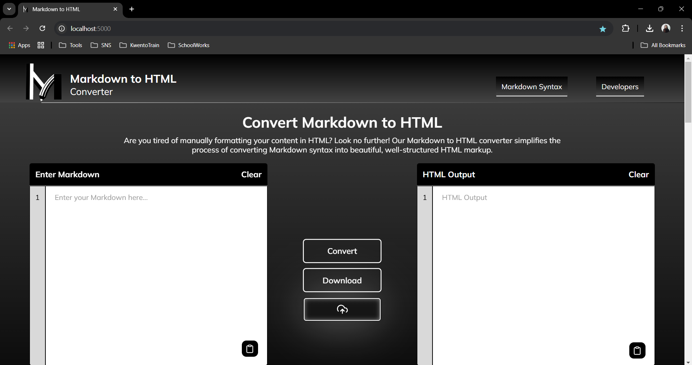
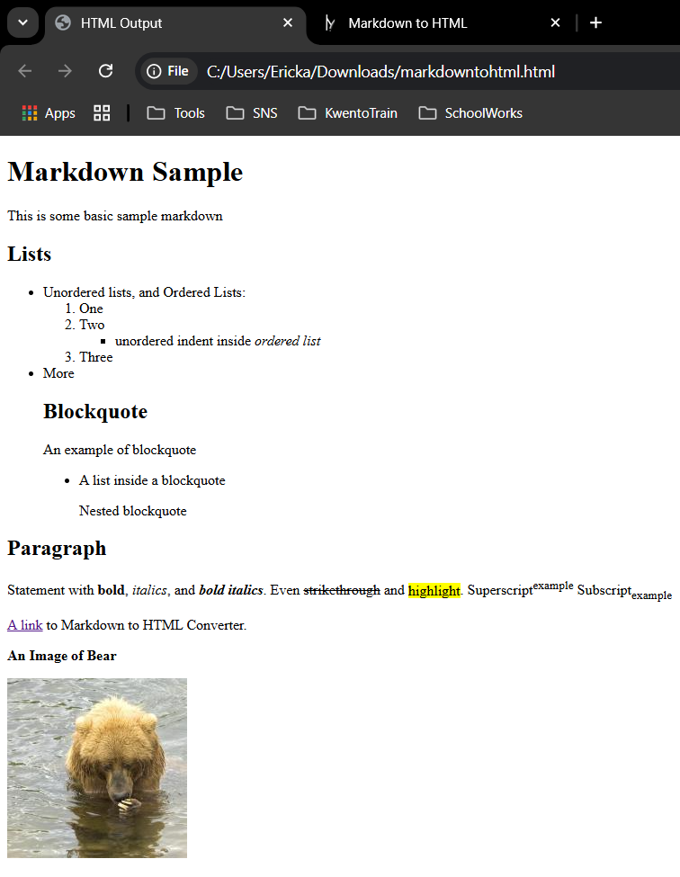

# Markdown to HTML Converter

A web-based application that converts Markdown to HTML. This tool allows users to input Markdown text or simply, upload Markdown files, and the content will be converted into HTML.

## Features
- **Markdown Input**: Type Markdown content directly into the input container to see the HTML equivalent.
- **File Upload**: Upload a `.md` file to automatically convert it into HTML and view the output.
- **Download HTML**: Download the converted HTML file for offline use.
- **User-Friendly Interface**: Simple, clean design for seamless conversion.

## How It Works
1. **Input Markdown**:
   - Enter Markdown text in the input container.
   - Click the **Convert** button
   - The converted HTML will appear in the adjacent or the output container.

2. **Upload Markdown File**:
   - Click the **Upload** button and select a `.md` file.
   - The app will automatically convert it and display the HTML.

3. **Download HTML**:
   - Once converted, click the **Download** button to save the HTML file.

## Technologies Used
- **Frontend**: HTML, CSS, JavaScript
- **Backend**: Node.js with Express
- **Algorithms**: Recursive Descent Parsing with CFG Principles

## RUN THE APP
- In the project directory, you can run `node app.js`.